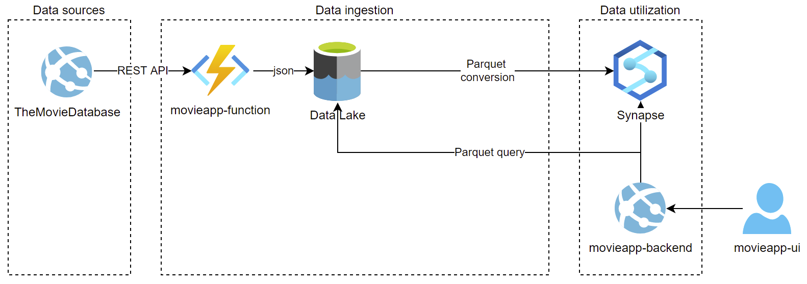

# movieapp
Custom application for showcasing frontend and backend implementation of a movie booking application.

## movieapp-function
Import movie details from The Movie Database Api and store to Data Lake.

## movieapp-backend
Fetch movie details from Synapse Serverless SQL Pool database.

## movieapp-common
Class library for common implementation.

## movieapp-ui
React frontend for showing the movie details.
